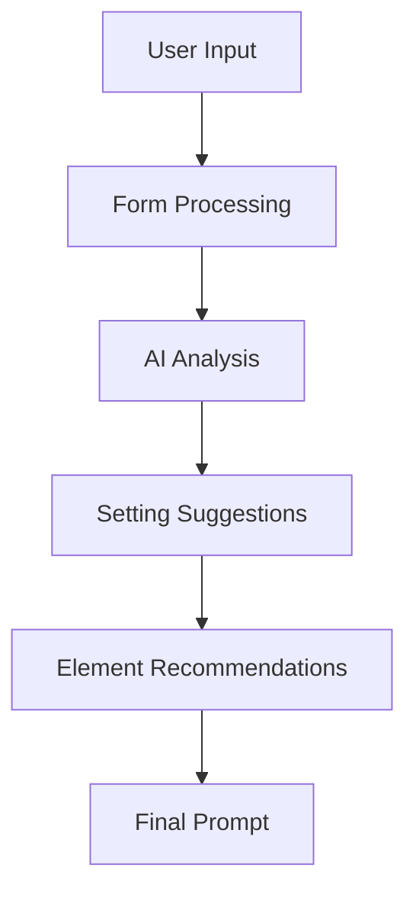

<!-- Architecture Documentation -->
# Architecture Documentation

## Overview

The AI Prompt Generator is built with a component-based architecture using React and TypeScript. It follows modern best practices for state management, component composition, and AI integration.

## Core Components

### Prompt Generation Flow

### Key Architectural Decisions

1. **AI Integration**
   - Using Gemini AI for intelligent suggestions
   - Asynchronous processing with proper error handling
   - Caching mechanisms for performance

2. **State Management**
   - Local component state for form data
   - Props for component communication
   - Custom hooks for reusable logic

3. **Component Structure**
   - Atomic design principles
   - Clear separation of concerns
   - Reusable UI components

## Data Flow

1. User inputs subjects and selects camera angle
2. AI analyzes inputs to suggest appropriate settings
3. Elements are dynamically recommended based on settings
4. Final prompt is generated combining all components

## Performance Considerations

- Debounced AI calls
- Optimized re-renders
- Lazy loading of components
- Proper error boundaries

## Security

- Environment variable management
- Input sanitization
- API key protection
- Rate limiting